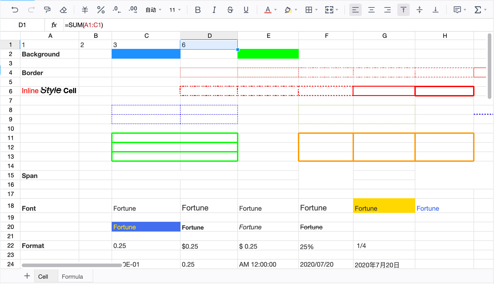

<p align="center">
  
</p>
<h1 align="center">FortuneSheet</h1>
<p align="center">FortuneSheet is a drop-in javascript spreadsheet library that provides rich features like Excel and Google Sheets</p>

<div align="center">

[](https://circleci.com/gh/ruilisi/fortune-sheet)
[](https://snyk.io/test/github/ruilisi/fortune-sheet)
[](https://github.com/umijs/father/)
[](https://xiemala.com/)

</div>


English | [简体中文](./README-zh.md)

## Purpose

The goal of `FortuneSheet` is to make a feature-rich, easy-to-configure online spreadsheet that you can use out-of-the-box.

This project is originated from [Luckysheet](https://github.com/mengshukeji/Luckysheet) and has inherited many code from it. Lots of efforts have done to translate the whole project to typescript (still in progress), and solved problems in the design of the original project.

We aim to make FortuneSheet powerful yet easy to maintain.

## Live demo

Take a look at the live demo at [fortune-sheet-demo](https://ruilisi.github.io/fortune-sheet-demo/)

<p>
  
</p>

## Attention
Before stable release of 1.0, input data structure and APIs may change during development. If you encounter errors after upgrading a version, check [Changelog](./CHANGELOG.md) and [Migration Guide](#migrating-data-from-luckysheet).

## Improvements to Luckysheet

- Written fully in typescript.
- You can now use `import` / `require` to use the library.
  ```js
  import { Workbook } from '@fortune-sheet/react'
  ```
- Multiple instance on the same page is supported.
- Dropped `jQuery` dependency, uses native `React` / `Vue` + `immer` to manage the dom and state.
- Changed to a forked [handsontable/formula-parser](https://github.com/handsontable/formula-parser) to handle formula calculations.
- Optimized the dom structure.
- Replaced icons from `iconfont` with SVGs, as `iconfont` icons are inconvenient to update for other maintainers.
- No visible elements is created outside container.
- Never stores data in the `window` object.

## Features

- Data structure is mostly compatible with Luckysheet (see [Migration Guide](#migrating-data-from-luckysheet)).
- **Formatting**: style, text alignment and rotation, text truncation, overflow, automatic line wrapping, multiple data types, cell segmentation style
- **Cells**: multiple selection, merge cells
- **Row & column**: insert, delete rows or columns
- **Operation**: copy, paste, cut, hot key
- **Formulas & Functions**: Built-in formulas

## Roadmap
- ✅ Support cooperative editing with backend storage.
- ✅ Support undo/redo.
- ✅ Mobile adaption.
- ✅ Expose APIs.
- ✅ Add tests.
- More basic features:
  - ✅ fill handle
  - fonts
  - ✅ format painter
  - ✅ comments
  - ✅ insert images
  - ✅ more toolbar buttons
- Excel import and export.
- Support Vue.
- More features:
  - ✅ sort
  - ✅ filter
  - ✅ hooks
  - conditional formatting
  - ✅ drag and drop
  - ✅ find and replace
  - location
  - data verification
  - ✅ freeze
  - hide, and split text
- More advanced features:
  - pivot tables
  - charts
  - ✅ screenshots

## Documentation

See detailed documentation at [fortune-sheet-doc](https://ruilisi.github.io/fortune-sheet-docs/)

## Get started (react)

### Download and install the library
```shell
yarn add @fortune-sheet/react
```
or using npm:
```shell
npm install @fortune-sheet/react
```

### Create an HTML placeholder
```html
<style>
  html, body, #root {
    width: 100%;
    height: 100%;
  }
</style>
<div id="root"></div>
```

**NOTE**: `width` and `height` doesn't have to be 100%, but should at least have a value. If set to `auto`, table area may not show.

### Render the sheet

```js
import React from 'react';
import ReactDOM from 'react-dom';
import { Workbook } from "@fortune-sheet/react";
import "@fortune-sheet/react/dist/index.css"

ReactDOM.render(
  <Workbook data={[{ name: "Sheet1" }]} />,
  document.getElementById('root')
);
```

### Backend storage and collabration

Each time a user operates on the sheet, an array of `Op` will be emiited through `onOp` callback. An op describes how to modify the current data to reach the new data after the user's operation. For example, here is an op when user sets the cell font to be bold on cell A2.

```json
[
    {
        "op": "replace",
        "index": "0",
        "path": ["data", 1, 0, "bl"],
        "value": 1
    }
]
```

The op is useful for database modification and syncing state in online collabration.

A working example with `Express` (backend server) and `MongoDB` (data persistence) is avaiable in `backend-demo` folder.

Run it with `node index.js` and visit [Collabration example](https://ruilisi.github.io/fortune-sheet-demo/?path=/story/collabration--example) (initialize data by visiting http://localhost:8081/init)

For detailed doc about `Op`, refer to [fortune-sheet-doc](https://ruilisi.github.io/fortune-sheet-docs/guide/op.html)

## Migrating data from Luckysheet
The overall data structure of FortuneSheet is the same as Luckysheet, with some naming differences:

1. sheet.index -> sheet.id
2. sheet.calcChain[].id -> sheet.calcChain[].id

## Contributing
Expected workflow is: Fork -> Patch -> Push -> Pull Request

Please make sure to read the [Contributing Guide](https://ruilisi.github.io/fortune-sheet-docs/guide/contribute.html) before making a pull request.


## Development
### Installation
```shell
yarn
```

### Development
```shell
yarn dev
```

### Packaging
```shell
yarn build
```

## License
This project is licensed under the MIT License. See [MIT](http://opensource.org/licenses/MIT) for the full license text.
